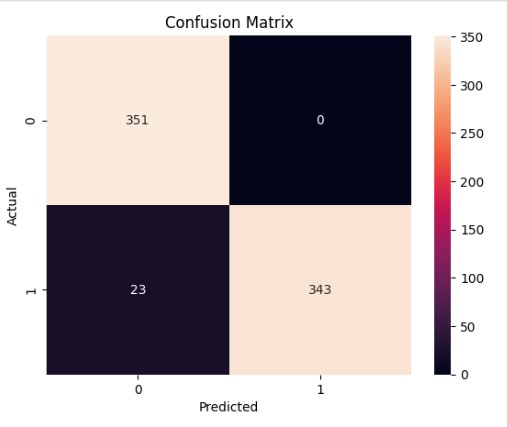
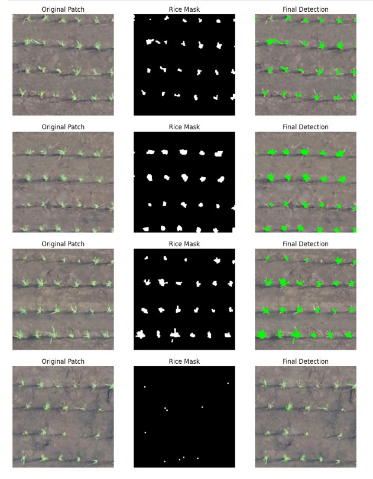

# 🌾 Smart Agriculture using MobileNet, SVM & K-Means

## 📄 Research Paper Implementation

This project is based on the paper:
**"Toward Precision Agriculture: Integrating Machine Learning Techniques for Smart Farming Systems"**

---

## 🚀 Overview

This project implements a smart agriculture system using Machine Learning and Deep Learning techniques.

It helps in:

* Crop vs Land classification
* Field segmentation for smart farming

---

## 🧠 Methodology

### 🔹 Pipeline

1. Data Preprocessing
2. Feature Extraction using MobileNet
3. Classification using SVM
4. Segmentation using K-Means
5. Evaluation

---

## ⚙️ Technologies Used

* Python
* TensorFlow / Keras
* Scikit-learn
* OpenCV
* NumPy
* Matplotlib

---

## 📷 Results

### Confusion Matrix

### Segmentation Output

---

## ⚠️ Note

NDVI preprocessing mentioned in the paper is not implemented due to dataset limitations.

---

## 📌 Conclusion

This project demonstrates how ML + DL can improve smart agriculture systems.
